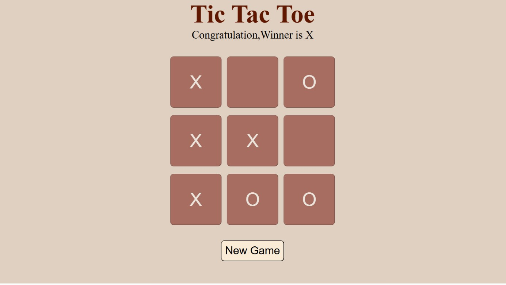

# ❌ Tic Tac Toe ⭕

A classic **Tic Tac Toe** game built using **HTML, CSS, and JavaScript**.

<p align="center">
  
  
  
  <a href="https://tic-tac-toe-mu-one-24.vercel.app/">
    
  </a>
</p>

---

## 📌 Overview

A responsive Tic Tac Toe game where two players compete by placing **X** and **O** on a 3×3 grid. The game automatically detects wins, draws, and allows players to start a new game with a single click.

---

## ✨ Features

- 🎮 Two Player Gameplay
- 🏆 Automatic Winner Detection
- 🤝 Draw Detection
- 🔄 New Game Button
- 📱 Responsive UI
- ⚡ Fast & Lightweight
- 🎨 Clean User Interface

---

## 🛠️ Tech Stack

- HTML5
- CSS3
- JavaScript (ES6)

---

## 🚀 Getting Started

### Clone the Repository

```bash
git clone https://github.com/Shravan-025/Tic-Tac-Toe.git
```

### Go to the Project Folder

```bash
cd Tic-Tac-Toe
```

### Run the Project

Simply open **index.html** in your browser.

Or run using **VS Code Live Server**.

---

## 🎯 How to Play

1. Player **X** starts the game.
2. Players take turns placing their marks.
3. The first player to get **three in a row** wins.
4. If all boxes are filled without a winner, the match ends in a draw.
5. Click **New Game** to play again.

---

## 📸 Gameplay Preview

<p align="center">
  
</p>
---

## 💡 Future Improvements

- 🤖 AI Opponent
- 🌙 Dark Mode
- 🔊 Sound Effects
- 📊 Scoreboard
- 🎉 Winning Animations

---

## 👨‍💻 Author

**Shravan Patel**

* GitHub: https://github.com/Shravan-025
* LinkedIn: www.linkedin.com/in/shravan-patel-b02546325

---

## ⭐ Show Your Support

If you found this project useful, consider giving it a ⭐ on GitHub!

---
